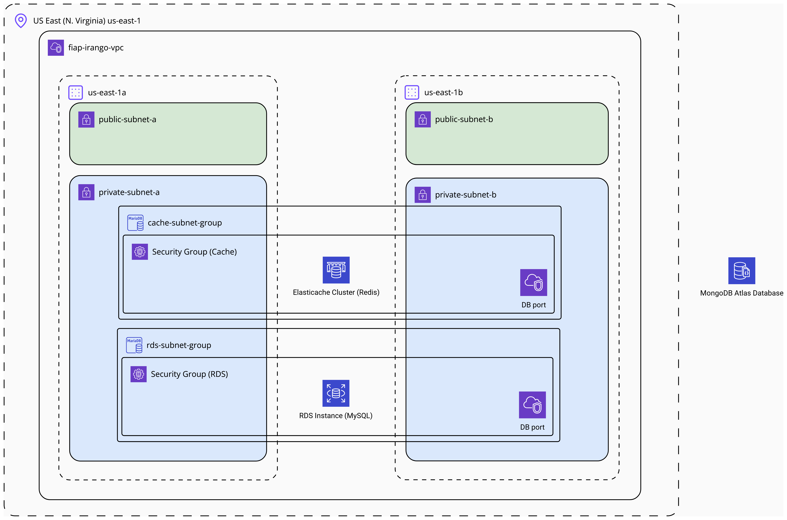

# Fiap iRango Database


## Architecture Diagram:


## Dependencies
- [Terraform](https://developer.hashicorp.com/terraform/install?product_intent=terraform)
- Make
  - [Windows](https://gnuwin32.sourceforge.net/packages/make.htm)
  - Linux:
  ```bash
  sudo apt update
  sudo apt install make
  ```

## Instructions to run
Before all, you need set AWS credentials and Database ENVs using:
```bash
export AWS_ACCESS_KEY_ID=xxxxxx
export AWS_SECRET_ACCESS_KEY=xxxxxx
export TF_VAR_DB_USERNAME=root
export TF_VAR_DB_PASSWORD=password
export MONGODB_ATLAS_PUBLIC_KEY=xxxxxx
export MONGODB_ATLAS_PRIVATE_KEY=xxxxxx
```
Or configure it in windows environments.

### Run databases locally
```bash
make db-up

# or without make
docker-compose up -d
```

### Using make
```bash
# To init terraform
make init

# To run terraform plan
make plan

# To apply changes
make up
```

To destroy resources:
```bash
make down
```


### Without make
```bash
# To init terraform
terraform -chdir=terraform init

# To run terraform plan
terraform -chdir=terraform plan

# To apply changes
terraform -chdir=terraform apply -auto-approve
```

To destroy resources:
```bash
terraform -chdir=terraform destroy -auto-approve
```
